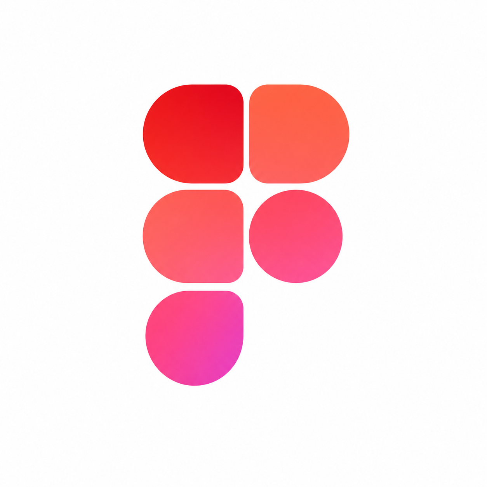

# Pinterest to Figma



Import a public Pinterest board into Figma.

Paste a Pinterest board link, click **Add pins to Figma**, and the plugin places the board's images, GIFs, and video stills into one clean section on your Figma canvas.

## What You Need

- Figma Desktop
- Node.js 18 or newer
- A public Pinterest board link

## Quick Start

1. Download or clone this project.
2. Double-click **Start Pinterest to Figma.command**.
3. Keep the terminal window open.
4. In Figma Desktop, open the plugin from **Plugins -> Development -> Pinterest to Figma**.
5. Paste a public Pinterest board link.
6. Click **Add pins to Figma**.

The pins will be added to the current Figma page.

## First-Time Figma Setup

You only need to do this once.

1. Open Figma Desktop.
2. Go to **Plugins -> Development -> Import plugin from manifest...**.
3. Choose the `manifest.json` file from this project folder.
4. After that, **Pinterest to Figma** will appear under **Plugins -> Development**.

## If The Start Button Does Not Work

You can start the helper manually:

```sh
npm start
```

Then open **Pinterest to Figma** in Figma and import your board.

## Why A Helper Is Needed

Pinterest blocks many direct requests from Figma plugins. The local helper fetches public Pinterest board pages and public `pinimg.com` media for the plugin.

It does not need a Pinterest account, database, API key, or login.

## Notes

- Only public Pinterest boards are supported.
- Each media asset is imported once where possible.
- Videos are imported as still images with a **VIDEO** badge.
- Keep the terminal window open while importing.
